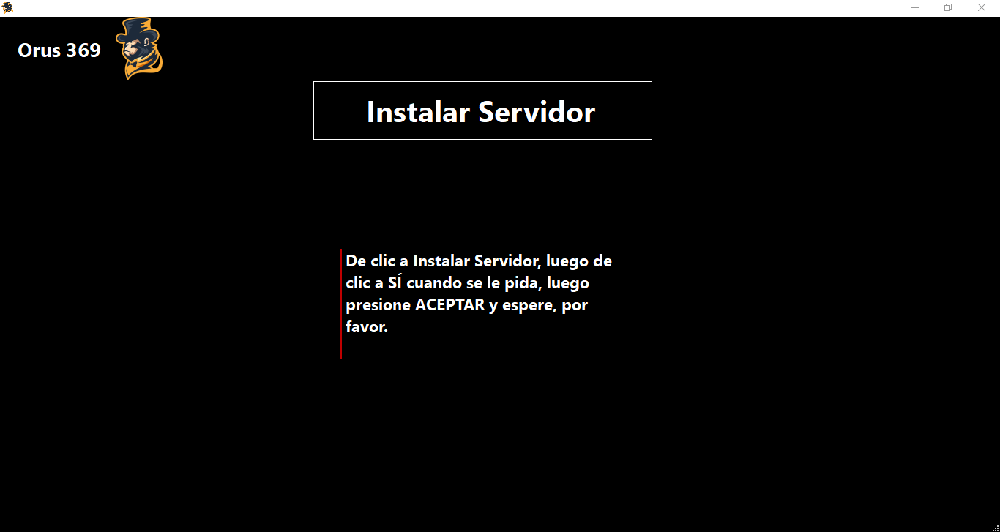

# Sistema de Asistencias

Aplicación que sirve para llevar el control de las asistencias de los trabajadores, así como de un control del personal de una empresa. Fue realizado a partir del curso [Sistema de asistencias en C# y SQL Server desde 0](https://www.udemy.com/course/sistema-de-asistencias-en-c-y-sqlserver-desde-0-2020/). La aplicación consta de varios módulos:

- **Asistente de instalación rápida**

Al ejecutar la aplicación, lo primero que hará será pedir que se le indique qué tipo de instalación se hará, si la computadora actual será un servidor o una conexión remota.


Si se da clic en 'Principal', de forma automática comenzará a buscar una instancia de _SQL Server_, si llega a encontrarla, creará una cadena de conexión al servidor encriptada y creará la base de datos.


Por el contrario, si no llega a encontrar ningún servidor SQL en la computadora, le pedirá al usuario instalar uno.



Una vez que se da clic en el botón 'Instalar Servidor', de forma automática se descargará _SQLEXPRESS_, se le pedirá al usuario seguir los pasos de instalación. Una vez terminada la instalación, la aplicación creará una cadena de conexión encriptada hacia el servidor, así como la base de datos.


Cuando se ejecuta por segunda vez la aplicación, se mostrará un formulario para crear el usuario Administrador, aquel que tendrá control total en el sistema.


Si en vez de elegir que sea una instalación Principal se selecciona Punto de Control, se pedirá la dirección IP de la computadora a la que se quiere conectar de manera remota:


- Login

Una vez creado el usuario principal, se mostrará la página del Login, que permitirá elegir a uno de los usuarios, por defecto, solo aparecerá el administrador.


Cuando se elige al usuario con el que se quiere loguear en el sistema, se le solicitará la contraseña. Si se da clic en el botón 'Cambiar de Usuario', regresará a la pantalla anterior.


Una vez ingresada la contraseña del usuario, se podrá acceder al Menú Principal.


- Modulo de personal

En la parte del Personal, se podrá llevar un control de los trabajadores de la empresa. En la parte superior se muestra un Buscador que sirve para encontrar a un trabajador por cualquiera de las columnas mostradas, además, del lado derecho el botón azul permite agregar personal. En la parte inferior se muestra un paginador, el cual comenzará a mostrar "páginas" conforme se vayan agregando personal, mostrará de 10 en 10.


Cuando se da clic en el botón para agregar nuevo Personal, pedirá la información del mismo. Al principio NO existen cargos. Si se da clic en el botón de la flecha verde, mostará la lista del personal. El botón para guardar un nuevo Personal no se mostrará hasta que se elija el cargo del trabajador.


Al dar clic en el botón 'Agregar cargo', pedirá la información del nuevo cargo, al dar clic en la flecha atrás, mostrará la pantalla para agregar un nuevo Personal.


- Modulo de Usuarios

Al dar clic en 'Usuarios', mostrará una lista con todos los usuarios que tienen acceso a la aplicación, por defecto, solo se encuentra el usuario administrador. En la parte superior muestra un buscador y un botón para agregar nuevos usuarios.


Si se agrega un nuevo usuario, pedirá el nombre de la persona, el nombre de su usuario que servirá para loguearse en la aplicación, una contraseña numérica, un ícono y a qué módulos se le permitirá tener acceso. Si se da clic en el botón Volver, mostrará la pantalla anterior.


Si se da clic en "Elegir un ícono", podrá elegir entre algunos ya definidos en la aplicación, o podrá elegir una imagen de la computadora. Si se da clic en Volver, mostrará la pantalla para seguir agregando la información del usuario.


- Copias de seguridad

Si se da clic en el botón 'Respaldos', se podrá crear una copia de seguridad. Debe darse clic en el ícono de la lupa o el label 'Ruta de Copias de Seguridad', al hacer esto, abrirá un cuadro para buscar en dónde se quiere guardar las copias generadas. Se creará una carpeta con el nombre de la aplicación que dentro habrá carpetas que contengan la fecha y hora en la que se hizo la copia de seguridad.


- Restauracion de base de datos

Al dar clic en el botón 'Restaurar BBDD', abrirá un cuadro de búsqueda, en la cual se debe elegir la copia de seguridad más reciente o a la que se quiere restarurar.

- Toma de asistencias

Al dar clic en el botón 'Registro', abrirá un nuevo formulario en el cual se registrará la hora de entrada o salida de un trabajador, esto se hará por su número de identificación. A continuación se da clic en el botón (Registra Entrada/Salida), si el número de identificación coincide con un trabjador en la base de datos, se registrará su entrada o salida, además de que abrirá una ventana permitiendo agregar una observación. El botón de 'Inciar Sesión', llevará al formulario de 'Login'.


## Tecnologías utilizadas

- .NET 5
- C#
- SQL Server

## Cómo realizar modificaciones

1. Clonar el repositorio:

```
git clone https://github.com/ESaulDJLaguna/estudio-SistemaDeAsistenciasCS.git
```

2. Acceder a la carpeta creada (Sistema-de-asistencias-CS) y abrir el archivo _Sistema de asistencias.sln_ utilizando [Visual Studio](https://visualstudio.microsoft.com/es/thank-you-downloading-visual-studio/?sku=Community&rel=17).
3. Una vez abierto el proyecto con Visual Studio, se creará la carpeta _bin_, dentro de ella, acceder a _Debug_, finalmente, entrar a la carpeta _net5.0-windows_ y pegar la cadena de Conexión (ConnectionString.xml) que se encuentra en la carpeta _Adicionales_, en la raíz del proyecto, esta se utilizará para almacenar la cadena de conexión encriptada para acceder al servidor.
4. Para que se pueda instalar de manera automática _SQL Server_, debe descargarse y guardarse en la misma carpeta donde se pegó la cadena de conexión. Se recomienda descargar la versión [Express 32BIT\SQLEXPR_x86_ENU.exe](https://www.microsoft.com/en-US/download/details.aspx?id=42299), ya que es la utilizada en el proyecto. **Además, la cadena de conexión debe ser eliminada y poner un texto cualquiera (no debe estar vacía, pero tampoco debe tener una cadena ya encriptada).**
